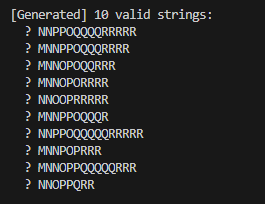
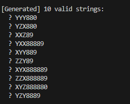
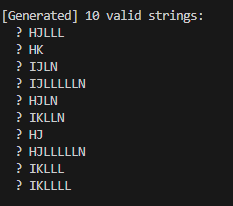

# Lab 4 — Regular Expressions & String Generation

**Course:** Formal Languages & Finite Automata  
**Author:** Dulgheru Ion  
**Group:** FAF-241


## Overview

This project implements a custom **regular expression parser** and **randomized string generator** in Java. It parses a regex pattern into an Abstract Syntax Tree (AST) and then traverses that tree to produce valid, structurally correct strings that match the defined pattern.

The implementation follows a mini-compiler pipeline:

```
Raw Regex String → Recursive Descent Parser → AST → String Generator → Output
```


## Theory

A regular expression is a mathematical notation for describing a set of strings — a *regular language*. It is strictly equivalent in power to finite state automata, but defines the language algebraically rather than procedurally.

Any regex can be built from three fundamental operations:

| Operation | Symbol | Meaning |
|-----------|--------|---------|
| Concatenation | (implicit) | Sequence of patterns |
| Alternation | `\|` | Choice between patterns |
| Kleene Star | `*` | Zero or more repetitions |

To process a regex efficiently, the raw string is first parsed into an **Abstract Syntax Tree (AST)** — a hierarchical in-memory structure where internal nodes represent operations and leaf nodes represent literal characters.


## Objectives

- Design and implement a regex parser using a recursive descent approach
- Build a robust AST capable of representing literals, sequences, alternations, and repetitions
- Generate randomized, valid strings by traversing the AST
- Implement a step-by-step internal logging system to visualize the parsing process


## Implementation

### AST Node Types

The entire structure is built on an abstract `Node` base class with four concrete implementations:

| Node Type | Description |
|-----------|-------------|
| `Literal` | A single character |
| `Sequence` | An ordered list of child nodes (concatenation) |
| `Alternation` | A choice between multiple branches |
| `Repeat` | A node repeated between `min` and `max` times |

### `Repeat` Node

```java
static class Repeat extends Node {
    final Node   inner;
    final int    min, max;
    final String sym;

    Repeat(Node inner, int min, int max, String sym) {
        this.inner = inner;
        this.min   = min;
        this.max   = max;
        this.sym   = sym;
    }

    @Override String generate() {
        int count = (min == max) ? min : min + RAND.nextInt(max - min + 1);
        StringBuilder sb = new StringBuilder();
        for (int i = 0; i < count; i++) sb.append(inner.generate());
        return sb.toString();
    }
}
```

### Parser

The parser uses a **recursive descent** approach with a global position pointer. Key methods:

- `parseSequence()` — collects nodes until it hits `|`, `)`, or end of input
- `parseAtom()` — identifies the current token and binds any trailing quantifier to it

Supported quantifiers:

| Symbol | Meaning |
|--------|---------|
| `?` | Zero or one |
| `*` | Zero to `MAX_REP` (capped at 5) |
| `+` | One to `MAX_REP` (capped at 5) |
| `²` (`\u00B2`) | Exactly 2 |
| `³` (`\u00B3`) | Exactly 3 |

```java
if (q == '*') {
    steps.add("QUANT  '*' (0.." + MAX_REP + ")");
    pos++;
    return new Repeat(node, 0, MAX_REP, "*");
}
if (q == '\u00B2') {
    steps.add("QUANT  '²' (exactly 2)");
    pos++;
    return new Repeat(node, 2, 2, "²");
}
```

### String Generation

The main driver parses each regex, prints the AST and step logs, then generates 10 unique valid strings using a `LinkedHashSet`:

```java
Set<String> seen = new LinkedHashSet<>();
int attempts = 0;
while (seen.size() < 10 && attempts < 200) {
    seen.add(root.generate());
    attempts++;
}
for (String s : seen) System.out.println("  → " + s);
```


## Challenges & Solutions

**Unbounded quantifiers (`*`, `+`)**  
Pure implementation risks infinitely long strings. Fixed by capping repetitions at `MAX_REP = 5`.

**Unicode superscript quantifiers (`²`, `³`)**  
Standard ASCII range checks fail for these characters. Solved by matching against explicit Java Unicode escape sequences (`\u00B2`, `\u00B3`).

**Alternation scope in nested groups**  
A naive parser could let `|` bleed outside its enclosing parentheses. Fixed by maintaining a *local* list of sequences per group, only wrapping them into an `Alternation` node when the closing `)` is reached.

## Results

The implementation was validated against three complex regex test cases involving nested groups, mixed quantifiers, and multiple alternations. For each:

- The parser logs correctly traced every token decision
- The AST structure matched the expected nesting
- Exactly 10 unique valid strings were generated per pattern
First Task :

Second Task :

Third Task :



## Project Structure

```
src/
└── RegexGenerator.java   # Single-class implementation containing:
                          #   - Node (abstract base)
                          #   - Literal, Sequence, Alternation, Repeat
                          #   - Recursive descent parser
                          #   - String generation driver
```


## How to Run

```bash
javac RegexGenerator.java
java RegexGenerator
```


## References

- Crafting Interpreters — Robert Nystrom — https://craftinginterpreters.com  
- *Compilers: Principles, Techniques, and Tools* — Aho, Lam, Sethi, Ullman  

