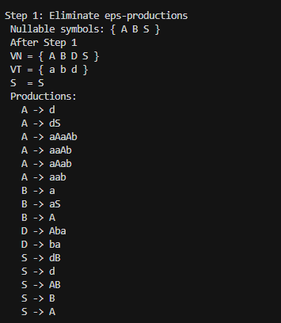
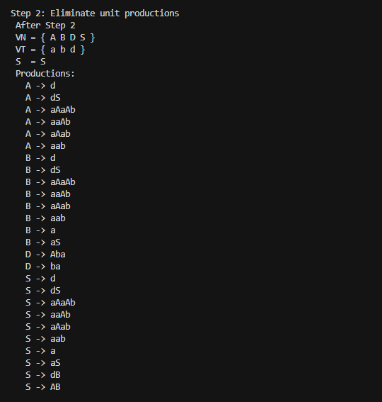
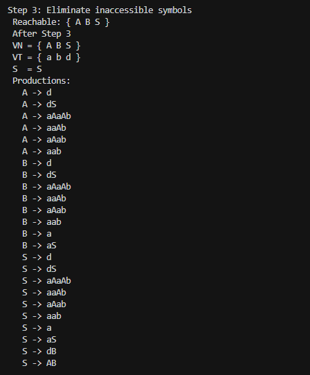
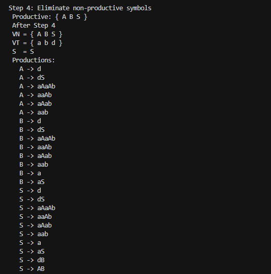
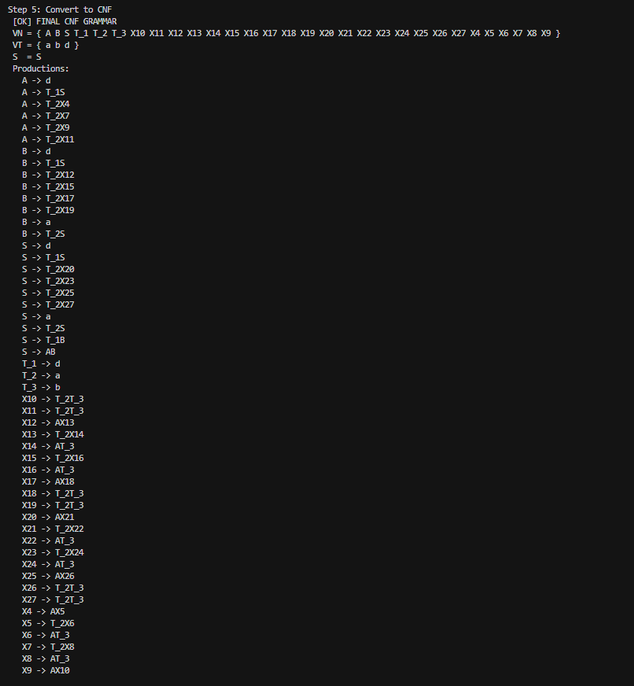

**Course:** Formal Languages & Finite Automata  
**Author:** Dulgheru Ion  
**Group:** FAF-241

---

## Overview

This project implements a complete **Chomsky Normal Form (CNF) normalisation pipeline** for Context-Free Grammars in C++17. Starting from an arbitrary CFG, the program applies five sequential, well-defined transformations that progressively clean and restructure the grammar until every production satisfies the strict two-form CNF constraint — without changing the language the grammar generates.

The implementation is fully encapsulated inside a single reusable `Grammar` class (defined in `grammar.h`) that can accept **any** context-free grammar as input, not only the one from Variant 10. The driver file `main.cpp` constructs the Variant 10 grammar and invokes the pipeline, printing the complete grammar state after each transformation step so every change is fully traceable.

The implementation follows a clean five-stage pipeline:
Input CFG
│
▼
[Step 1] Eliminate ε-productions
│
▼
[Step 2] Eliminate unit (renaming) productions
│
▼
[Step 3] Eliminate inaccessible symbols
│
▼
[Step 4] Eliminate non-productive symbols
│
▼
[Step 5] Convert remaining productions to binary CNF form
│
▼
CNF Grammar

---

## Theory

### Context-Free Grammars

A **Context-Free Grammar (CFG)** is a 4-tuple `G = (V_N, V_T, P, S)` where:

- `V_N` — a finite set of **non-terminal** symbols
- `V_T` — a finite set of **terminal** symbols, disjoint from `V_N`
- `P` — a finite set of **production rules** of the form `A → α`, where `A ∈ V_N` and `α ∈ (V_N ∪ V_T)*`
- `S ∈ V_N` — the **start symbol**

CFGs are strictly more expressive than regular grammars and are used to describe the syntax of most programming languages.

### What is Chomsky Normal Form?

A CFG is in **Chomsky Normal Form (CNF)** if and only if every production rule has exactly one of the following two forms:

| Form | Description | Example |
|------|-------------|---------|
| `A → BC` | Exactly two non-terminals | `S → AB` |
| `A → a` | Exactly one terminal | `A → d` |

The only exception allowed is `S → ε` if the original grammar generates the empty string and `S` does not appear on the right-hand side of any rule.

### Why is CNF Important?

CNF is not just a theoretical curiosity — it has significant practical consequences:

- **CYK Algorithm** — The Cocke–Younger–Kasami parsing algorithm requires the grammar to be in CNF. It decides in `O(n³)` time whether a string of length `n` belongs to the language.
- **Proof simplification** — Many theoretical results about CFGs are easier to prove when the grammar is in CNF, because the binary tree structure makes induction arguments cleaner.
- **Compiler design** — CNF and similar normal forms serve as the foundation for efficient bottom-up and top-down parsers.

### The Five Transformation Steps

Every CFG can be converted to CNF in five ordered steps. Each step preserves the language generated by the grammar (except possibly for `ε`, which is handled explicitly).

**Step 1 — Eliminate ε-productions**  
A production `A → ε` is called an *ε-production*. To remove them, we first identify all *nullable* symbols — those that can eventually derive the empty string. Then, for every production that contains a nullable symbol on its right-hand side, we add new versions of that production where the nullable symbol is optionally omitted (all non-empty subsets). Finally, all `A → ε` rules are removed.

**Step 2 — Eliminate unit productions**  
A production of the form `A → B` (where both `A` and `B` are non-terminals) is called a *unit production* or *renaming*. These are removed by computing the *unit closure*: if `A →* B` through a chain of unit rules, then every non-unit production of `B` is copied directly to `A`. The unit rules themselves are then discarded.

**Step 3 — Eliminate inaccessible symbols**  
A non-terminal `A` is *inaccessible* if there is no derivation starting from the start symbol `S` that ever produces a sentential form containing `A`. Such symbols and all their associated productions are dead weight and can be removed safely.

**Step 4 — Eliminate non-productive symbols**  
A non-terminal `A` is *non-productive* (or *useless*) if there is no derivation `A →* w` where `w` is a string of terminals. These symbols can never contribute to any complete string in the language and must be removed along with any production that references them.

**Step 5 — Convert to binary CNF form**  
After the four cleanup steps, the only remaining violations of CNF are:
- Productions longer than 2 symbols: `A → B1 B2 B3 ...`
- Productions of length ≥ 2 that mix terminals and non-terminals: `A → aB`

These are fixed by:
1. Introducing a new non-terminal `T_x → x` for each terminal `x` that appears in a mixed or long production, then replacing every such occurrence with `T_x`.
2. Breaking every production of length > 2 into a right-recursive chain of binary productions using fresh helper non-terminals `X1, X2, ...`.

---

## Objectives

1. Understand the theoretical foundation of Chomsky Normal Form and the necessity of each transformation step
2. Implement each step correctly and independently as a method of the `Grammar` class
3. Encapsulate the full pipeline in a way that works for **any** input CFG, not just Variant 10
4. Print the complete grammar state (V_N, V_T, productions) after each step to allow full inspection
5. Validate correctness on the Variant 10 grammar by tracing the expected changes manually and comparing with program output

---

## Variant 10 — Input Grammar
G = (V_N, V_T, P, S)
V_N = {S, A, B, D}
V_T = {a, b, d}

S → dB
S → AB
A → d
A → dS
A → aAaAb
A → ε
B → a
B → aS
B → A
D → Aba


This grammar has several features that exercise every step of the pipeline:
- Rule 6 (`A → ε`) introduces a nullable symbol that propagates to B and S
- Rule 9 (`B → A`) is a unit production
- Rule 5 (`A → aAaAb`) is a long mixed production that requires both terminal wrapping and binarisation
- Symbol D is only used in rule 10 and is never reachable from S, making it inaccessible

---

## Implementation

The entire logic is contained in two files:

- **`grammar.h`** — the `Grammar` class with all transformation methods
- **`main.cpp`** — the driver that constructs the Variant 10 grammar and runs the pipeline

### Data Representation
```cpp
using RHS  = std::vector<std::string>;   // one right-hand side
using PMap = std::map<std::string, std::vector<RHS>>;  // all productions

class Grammar {
    std::set<std::string> VN;   // non-terminals
    std::set<std::string> VT;   // terminals
    PMap                  P;    // production rules
    std::string           S;    // start symbol
    int                   freshCounter = 0;
};
```

Each symbol (terminal or non-terminal) is stored as a `std::string`. This means multi-character non-terminal names like `T_1` or `X12` are handled naturally without any special encoding.

### Grammar Class — Method Summary

| Method | Description |
|--------|-------------|
| `findNullable()` | BFS/fixpoint iteration to collect all nullable symbols |
| `eliminateEpsilon()` | Removes ε-rules; uses bitmask enumeration to generate all subset replacements |
| `eliminateUnitProductions()` | Computes transitive unit-pair closure; rewires productions |
| `eliminateInaccessible()` | DFS from S; drops every non-terminal not reachable from the start |
| `eliminateNonProductive()` | Iterative bottom-up marking; removes symbols that derive no terminal string |
| `convertToCNF()` | Introduces `T_x` wrappers; right-recursive binarisation of long rules |
| `toCNF()` | Orchestrates all five steps; prints state after each |
| `freshNT(prefix)` | Generates a unique new non-terminal name with a given prefix |
| `addProduction()` | Adds a production only if not already present (deduplication) |
| `print(title)` | Prints the full grammar in a readable format |

---

### Step 1 — Eliminate ε-productions

First, all nullable symbols are identified using a fixpoint loop: a symbol is nullable if it has a direct `A → ε` rule, or if all symbols on some right-hand side are themselves nullable.
```cpp
std::set<std::string> findNullable() const {
    std::set<std::string> nullable;
    bool changed = true;
    while (changed) {
        changed = false;
        for (const auto& [lhs, rhsList] : P) {
            for (const auto& rhs : rhsList) {
                bool allNull = true;
                for (const auto& sym : rhs)
                    if (!nullable.count(sym)) { allNull = false; break; }
                if ((rhs.empty() || allNull) && !nullable.count(lhs)) {
                    nullable.insert(lhs);
                    changed = true;
                }
            }
        }
    }
    return nullable;
}
```

Then, for every production containing nullable symbols, all `2^k` non-empty subsets of nullable positions are generated using a bitmask, producing new rules where those symbols are optionally absent:
```cpp
for (int mask = 0; mask < (1 << sz); ++mask) {
    RHS candidate;
    for (int i = 0; i < (int)rhs.size(); ++i) {
        bool omit = false;
        for (int b = 0; b < sz; ++b)
            if ((mask >> b & 1) && nullPos[b] == i) { omit = true; break; }
        if (!omit) candidate.push_back(rhs[i]);
    }
    if (!candidate.empty()) newP[lhs].push_back(candidate);
}
```

For Variant 10, nullable symbols are `{A, B, S}`. For example, `A → aAaAb` generates three new rules: `A → aaAb`, `A → aAab`, and `A → aab`.

---

### Step 2 — Eliminate unit productions

Unit pairs `(A, B)` meaning `A →* B` via a chain of unit rules are collected by transitive closure:
```cpp
std::set<std::pair<std::string,std::string>> unitPairs;
for (const auto& nt : VN) unitPairs.insert({nt, nt}); // reflexive base

bool changed = true;
while (changed) {
    changed = false;
    for (const auto& [x, y] : unitPairs) {
        for (const auto& rhs : P[y]) {
            if (rhs.size() == 1 && isNonTerminal(rhs[0])) {
                auto pr = std::make_pair(x, rhs[0]);
                if (!unitPairs.count(pr)) { unitPairs.insert(pr); changed = true; }
            }
        }
    }
}
```

For each pair `(A, B)`, all non-unit productions of `B` are copied into `A`. The unit rules themselves are not copied.

For Variant 10, unit pairs found are `(S, A)`, `(S, B)`, and `(B, A)`. This causes S and B to inherit all of A's productions, and S to also inherit all of B's productions.

---

### Step 3 — Eliminate inaccessible symbols

A simple DFS from the start symbol `S` collects all reachable non-terminals. Every non-terminal not in this set is removed along with its productions:
```cpp
std::set<std::string> reachable;
std::vector<std::string> queue = {S};
while (!queue.empty()) {
    std::string cur = queue.back(); queue.pop_back();
    if (reachable.count(cur)) continue;
    reachable.insert(cur);
    for (const auto& rhs : P[cur])
        for (const auto& sym : rhs)
            if (isNonTerminal(sym) && !reachable.count(sym))
                queue.push_back(sym);
}
```

For Variant 10, `D` is never reachable from `S` — no production of `S`, `A`, or `B` ever mentions `D`. Therefore `D` and its rules `D → Aba | ba` are removed entirely. `V_N` becomes `{S, A, B}`.

---

### Step 4 — Eliminate non-productive symbols

Productivity is determined bottom-up: a symbol is productive if at least one of its right-hand sides consists entirely of terminals and already-proven-productive non-terminals.
```cpp
std::set<std::string> productive;
bool changed = true;
while (changed) {
    changed = false;
    for (const auto& [lhs, rhsList] : P) {
        for (const auto& rhs : rhsList) {
            bool ok = true;
            for (const auto& sym : rhs)
                if (!isTerminal(sym) && !productive.count(sym)) { ok = false; break; }
            if (ok && !productive.count(lhs)) { productive.insert(lhs); changed = true; }
        }
    }
}
```

For Variant 10, all three remaining symbols `{A, B, S}` are productive (`A → d`, `B → a`, `S → d`), so nothing is removed in this step.

---

### Step 5 — Convert to CNF

**5a) Wrap terminals** appearing in productions of length ≥ 2 with dedicated non-terminals:
```cpp
auto getTermNT = [&](const std::string& t) -> std::string {
    if (!termMap.count(t)) {
        std::string nt = freshNT("T_");
        termMap[t] = nt;
        newP[nt] = {{t}};
    }
    return termMap[t];
};
```

This produces `T_1 → d`, `T_2 → a`, `T_3 → b`.

**5b) Binarise** every production of length > 2 by introducing right-recursive chains of helper non-terminals:
```cpp
while (remaining.size() > 2) {
    std::string next = freshNT("X");
    binaryP[cur].push_back({remaining[0], next});
    remaining.erase(remaining.begin());
    cur = next;
}
binaryP[cur].push_back(remaining);
```

For example, `A → aAaAb` becomes (after terminal wrapping: `T_2 A T_2 A T_3`):
A  → T_2 X4
X4 → A  X5
X5 → T_2 X6
X6 → A  T_3

---

## Results

**Step 1 — After eliminating ε-productions:**



**Step 2 — After eliminating unit productions:**



**Step 3 — After eliminating inaccessible symbols:**



**Step 4 — After eliminating non-productive symbols:**



**Step 5 — Final CNF Grammar:**



---

## Key Observations

- **Nullable symbols propagate transitively** — A single `A → ε` caused both B and S to become nullable because of the chain `B → A` and `S → AB`.
- **Unit productions cause rule explosion** — Resolving `(S,A)`, `(S,B)`, `(B,A)` copies many productions into S and B. This is expected and correct behaviour.
- **D is silently dead** — Although D has a valid production `D → Aba`, no path from S ever reaches D. Step 3 catches this automatically.
- **Step 4 is a no-op here** — After removing D, all remaining symbols can produce terminal strings, so the step leaves the grammar unchanged. This is nonetheless an important verification.
- **Binarisation creates many helper NTs** — The production `A → aAaAb` alone requires 3 helper non-terminals per occurrence across A, B, and S (since B and S inherited it). This is why the final grammar contains `X4` through `X27`.
- **Terminal wrappers are shared** — `T_1`, `T_2`, `T_3` are introduced once and reused across all productions, minimising the number of new symbols.

---

## Conclusions

This laboratory work demonstrated the full theoretical and practical pipeline for converting an arbitrary CFG into Chomsky Normal Form. Each transformation step was implemented independently and tested on the Variant 10 grammar, with the program printing the complete grammar state after every step for full traceability.

The most challenging aspect was correctly implementing Step 1 (ε-elimination), since nullable symbols can propagate transitively and the bitmask enumeration of nullable positions must handle all edge cases without introducing empty productions. Step 2 (unit elimination) required careful attention to transitivity — it is not enough to resolve direct unit rules; the full transitive closure must be computed first.

The final CNF grammar is equivalent to the original: it generates exactly the same language (minus `ε` if applicable), but every production is now either `A → BC` or `A → a`, making it directly usable by algorithms such as CYK parsing.

---

## Project Structure
Lab5/
├── grammar.h     # Grammar class — all five transformation steps
├── main.cpp      # Driver — defines Variant 10 grammar, calls toCNF()
├── main.exe      # Compiled binary (Windows)
├── STEP1.png     # Output screenshot after Step 1
├── STEP2.png     # Output screenshot after Step 2
├── STEP3.png     # Output screenshot after Step 3
├── STEP4.png     # Output screenshot after Step 4
└── STEP5.png     # Output screenshot after Step 5

---

## How to Build & Run
```bash
g++ -std=c++17 -Wall -o main main.cpp
./main
```

On Windows (CMD):
```cmd
g++ main.cpp -o main && main.exe
```

---

## References

- [Chomsky Normal Form — Wikipedia](https://en.wikipedia.org/wiki/Chomsky_normal_form)
- Hopcroft, Motwani, Ullman — *Introduction to Automata Theory, Languages, and Computation*, 3rd ed.
- Sipser, Michael — *Introduction to the Theory of Computation*, 3rd ed.
- Course slides — Formal Languages & Finite Automata, TUM — Vasile Drumea, Irina Cojuhari