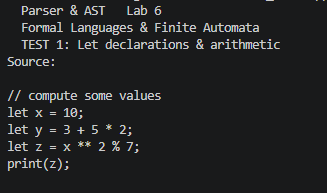
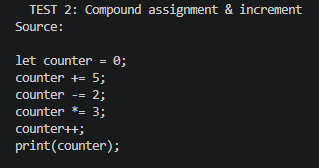
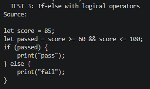
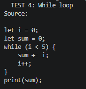
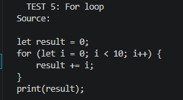
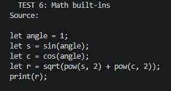
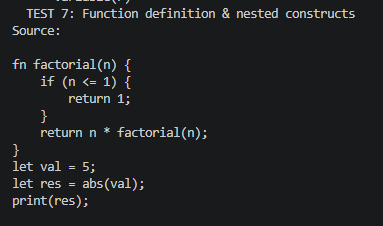

# Topic: Parser & Building an Abstract Syntax Tree

**Course:** Formal Languages & Finite Automata  
**Author:** Cretu Dumitru  
**Group:** FAF-241  

---

## Overview

This project extends the Lexical Analyzer built in Lab 3 with a complete **Syntactical Analyzer (Parser)** written in C++17. The full pipeline accepts a raw source code string as input and transforms it step by step into a structured **Abstract Syntax Tree (AST)**, which is the standard intermediate representation used by compilers and interpreters to understand the meaning of a program.

The motivation for building an AST rather than simply checking syntax is that the tree captures the semantic intent of the code. A raw list of tokens tells you what words appear in the source, but not how they relate to each other. The AST encodes those relationships explicitly: it knows that in `3 + 5 * 2`, the multiplication must be computed first because the `BinaryOp(*)` node sits deeper in the tree than the `BinaryOp(+)` node. This hierarchical structure can then be walked, transformed, or compiled into machine instructions.

The pipeline is divided into three cleanly separated components:

```text
Source String
│
▼
[Lexer]  — tokenizes the string using regular expressions
│
▼
[AST Nodes]  — a polymorphic C++ hierarchy representing every construct
│
▼
[Parser]  — a recursive descent parser that builds the AST
│
▼
Abstract Syntax Tree (AST)
```

---

## Theory

### 1. Lexical Analysis and Tokenization

The first stage of compilation is lexical analysis, where a continuous stream of characters is broken into discrete, typed units called **tokens**. Each token carries a type (such as `INTEGER`, `IDENTIFIER`, `WHILE`, or `PLUS_ASSIGN`) and the literal value matched from the source. In this project, tokenization is driven entirely by **regular expressions** via `std::regex`, which allows complex patterns — multi-character operators, escaped string literals, floating-point numbers — to be described concisely in a single rule.

The order of rules is not arbitrary. Because `std::regex_search` returns the first match, compound operators like `+=` and `++` must appear before their single-character components `+` to prevent the lexer from greedily consuming only the first character. Similarly, keywords such as `let`, `fn`, and `while` are bounded with `\b` word-boundary anchors to differentiate between a variable named `letting` and the keyword `let`.

### 2. Abstract Syntax Tree (AST)

A **Concrete Syntax Tree** (or parse tree) mirrors the grammar rules exactly, including every bracket, comma, and semicolon. An **Abstract Syntax Tree** strips away those syntactic artifacts and preserves only the logical structure. The expression `(3 + 5)` becomes a `BinaryOp(+)` node with two `IntLiteral` children. The parentheses vanish from the tree, but their effect is preserved because everything inside them forms a single unified subtree.

This abstraction is what makes ASTs the preferred representation for subsequent compiler stages. A tree-walking interpreter can evaluate the AST by recursively visiting each node. A type checker can annotate each node with type information. A code generator can emit machine instructions in the correct order simply by visiting children before parents in expressions.

### 3. Recursive Descent Parsing

A **recursive descent parser** is a top-down parsing technique in which each non-terminal of the grammar is implemented as a C++ function. The functions call each other according to the grammar rules, and the call stack implicitly represents the current parsing context.

Operator precedence is encoded through the depth of the call chain. Lower-precedence operators are handled by functions higher up in the chain, which means they appear closer to the root of the tree and are therefore evaluated last. Higher-precedence operators are handled deeper in the chain and become deeper nodes, evaluated first. The full precedence hierarchy in this parser is:

```
parseExpression  →  parseOr  →  parseAnd  →  parseEquality
  →  parseComparison  →  parseAddition  →  parseMultiply
  →  parseUnary  →  parsePostfix  →  parsePrimary
```

Left-associativity (so that `10 - 5 - 2` is read as `(10 - 5) - 2` and not `10 - (5 - 2)`) is achieved by using `while` loops rather than right-recursion. Each iteration of the loop wraps the previously built subtree as the left child of a new `BinaryOp`, naturally producing a left-leaning tree.

---

## Objectives

The objectives of this laboratory work are the following. First, to get familiar with parsing as a concept and understand how it is implemented programmatically. Second, to define a `TokenType` enumeration that categorizes all possible tokens the language can produce. Third, to use regular expressions (`std::regex`) inside the lexer to match those tokens from the source string. Fourth, to implement a polymorphic AST node hierarchy in C++ that can represent every construct of the language. Fifth, to build a recursive descent parser that consumes the token stream and produces a fully formed AST. And sixth, to print the resulting AST in a human-readable indented format that makes the tree structure immediately visible.

---

## Implementation

The project is organized into four files with clearly separated responsibilities. `lexer.h` handles tokenization using regular expressions and defines the `TokenType` enum and the `Token` struct. `ast.h` defines the full AST node hierarchy with a base `ASTNode` class and one concrete struct per language construct. `parser.h` contains the recursive descent parser that consumes tokens and produces AST nodes. `main_lab6.cpp` is the driver that runs seven comprehensive test cases, printing tokens and the resulting AST for each one.

### Data Representation — AST Nodes

Object-oriented polymorphism is the foundation of the AST. A base struct provides the interface that all nodes share:

```cpp
struct ASTNode {
    virtual ~ASTNode() = default;
    virtual void print(int indent = 0) const = 0;
};
using NodePtr = std::unique_ptr<ASTNode>;
```

Memory is managed entirely through `std::unique_ptr<ASTNode>`, aliased as `NodePtr`. Because each node owns its children via `NodePtr`, destroying the root `Program` node recursively destroys the entire tree with no manual `delete` calls needed.

The concrete node types cover the full range of language constructs. For literals there are `IntLiteral`, `FloatLiteral`, `StringLiteral`, and `BoolLiteral`. For expressions there are `Variable` (a name reference), `BinaryOp` (any two-operand operator), `UnaryOp` (prefix `-`, `!`, `++`, `--`), `PostfixOp` (suffix `++`/`--`), `MathCall` (built-in math functions), and `FunctionCall` (user-defined function calls). For statements there are `LetDecl`, `Assignment`, `CompoundAssign`, `PrintStmt`, `ReturnStmt`, `IfStmt`, `WhileStmt`, `ForStmt`, and `FunctionDef`. The root of every parse is a `Program` node holding a list of top-level statements.

### The Lexer (`lexer.h`)

The lexer iterates over the source string, at each position trying each regex rule in order until one matches at the current position. The matched text is consumed and a `Token` is emitted. Whitespace rules map to `TokenType::ILLEGAL` and are silently discarded rather than emitted, keeping the token stream clean for the parser.

A small but important detail is that the regex patterns are anchored with `^(?:...)` so that `std::regex_search` only matches at the very start of the remaining string. Without this anchoring, a pattern could skip characters and match in the middle of a word.

```cpp
// Multi-character operators must precede their single-character components
{ "\\+\\+",                    TokenType::INCREMENT    },
{ "\\+=",                      TokenType::PLUS_ASSIGN  },
{ "\\+",                       TokenType::PLUS         },

// Keywords use word-boundary anchors to avoid matching identifier prefixes
{ "let\\b",                    TokenType::LET          },
{ "[a-zA-Z_][a-zA-Z0-9_]*",   TokenType::IDENTIFIER   }
```

The lexer also tracks line and column numbers for every token, which allows the parser to produce useful error messages like `Parse error at line 7: expected ';', got "}"` instead of generic failures.

### The Parser (`parser.h`)

The parser is built around three core helpers. `check(TokenType)` looks at the current token without consuming it. `match(TokenType)` consumes the token if it matches and returns `true`, otherwise does nothing and returns `false`. `expect(TokenType, message)` consumes the token if it matches or throws a `std::runtime_error` with a descriptive message including the line number.

#### Operator Precedence and Left-Associativity

The key insight of the recursive descent approach is that the precedence table is embedded directly in the structure of the function calls. Here is how left-associativity and precedence are handled together in `parseAddition`:

```cpp
NodePtr parseAddition() {
    auto left = parseMultiply();
    while (check(TokenType::PLUS) || check(TokenType::MINUS)) {
        std::string op = tokens[pos++].value;
        left = std::make_unique<BinaryOp>(op, std::move(left), parseMultiply());
    }
    return left;
}
```

Each iteration of the `while` loop takes the tree built so far as the left child and attaches a new right subtree, producing the correct left-leaning structure. Since `parseAddition` delegates to `parseMultiply` for its operands, multiplication nodes always end up deeper in the tree than addition nodes, meaning they are evaluated first.

#### Statement Dispatch

The top-level `parseStatement` function dispatches to the correct handler by inspecting the current token:

```cpp
NodePtr parseStatement() {
    if (check(TokenType::FN))     return parseFnDef();
    if (check(TokenType::LET))    return parseLetDecl();
    if (check(TokenType::RETURN)) return parseReturn();
    if (check(TokenType::PRINT))  return parsePrint();
    if (check(TokenType::IF))     return parseIf();
    if (check(TokenType::WHILE))  return parseWhile();
    if (check(TokenType::FOR))    return parseFor();
    // ...
}
```

When an `IDENTIFIER` token is seen, the parser peeks one token ahead to decide between a plain assignment (`x = expr`), a compound assignment (`x += expr`), and a postfix statement (`x++`).

#### Complex Statement Parsing — For Loop

The `for` loop is the most structurally complex statement the parser handles, because its header contains three distinct sub-clauses separated by semicolons, followed by a block body. The parser handles each clause independently:

```cpp
NodePtr parseFor() {
    expect(TokenType::FOR,    "'for'");
    expect(TokenType::LPAREN, "'('");
    auto node = std::make_unique<ForStmt>();

    if (check(TokenType::LET)) node->init = parseLetDecl();
    else                       node->init = parseAssignment();

    node->condition = parseExpression();
    expect(TokenType::SEMICOLON, "';'");

    std::string uname = expect(TokenType::IDENTIFIER, "identifier").value;
    if (check(TokenType::INCREMENT) || check(TokenType::DECREMENT)) {
        std::string op = tokens[pos++].value;
        node->update = std::make_unique<PostfixOp>(
            op, std::make_unique<Variable>(uname));
    } else if (isCompoundAssign()) {
        std::string op = tokens[pos++].value;
        auto val = parseExpression();
        node->update = std::make_unique<CompoundAssign>(uname, op, std::move(val));
    }

    expect(TokenType::RPAREN, "')'");
    node->body = parseBlock();
    return node;
}
```

The update clause supports both `i++`/`i--` and `i += expr`, making the for loop flexible enough to cover all common iteration patterns.

---

## Results and Testing

The program is evaluated using seven test cases embedded directly in `main_lab6.cpp`. Each test prints the full token list produced by the lexer, followed by the indented AST produced by the parser.

### Test 1 — Let Declarations and Arithmetic

The input tests basic variable declarations and arithmetic with mixed operators:




The resulting AST shows that `*` was correctly bound tighter than `+`, placing the multiplication node deeper in the tree. Similarly, `**` was bound tighter than `%`:

```
Program
  LetDecl(x)
    IntLiteral(10)
  LetDecl(y)
    BinaryOp(+)
      IntLiteral(3)
      BinaryOp(*)
        IntLiteral(5)
        IntLiteral(2)
  LetDecl(z)
    BinaryOp(%)
      BinaryOp(**)
        Variable(x)
        IntLiteral(2)
      IntLiteral(7)
  PrintStmt
    Variable(z)
```

### Test 2 — Compound Assignment and Increment




All compound assignment operators and the postfix increment are parsed into their dedicated node types (`CompoundAssign` and `PostfixOp`), rather than being desugared into plain `Assignment` nodes. This preserves the original intent of the source code in the AST:

```
Program
  LetDecl(counter)
    IntLiteral(0)
  CompoundAssign(counter +=)
    IntLiteral(5)
  CompoundAssign(counter -=)
    IntLiteral(2)
  CompoundAssign(counter *=)
    IntLiteral(3)
  PostfixOp(++)
    Variable(counter)
  PrintStmt
    Variable(counter)
```

### Test 3 — If-Else with Logical Operators




The boolean expression is parsed with correct precedence: `>=` and `<=` bind tighter than `&&`, so the two comparison nodes become children of the `BinaryOp(&&)`. The if-else branches are separated into named `[then]` and `[else]` subtree lists:

```
IfStmt
  [condition]
    Variable(passed)
  [then]
    PrintStmt
      StringLiteral("pass")
  [else]
    PrintStmt
      StringLiteral("fail")
```

### Test 4 — While Loop




The loop condition and body are cleanly separated in the `WhileStmt` node. The body contains both a `CompoundAssign` and a `PostfixOp`, demonstrating that any valid statement can appear inside a block:

```
WhileStmt
  [condition]
    BinaryOp(<)
      Variable(i)
      IntLiteral(5)
  [body]
    CompoundAssign(sum +=)
      Variable(i)
    PostfixOp(++)
      Variable(i)
```

### Test 5 — For Loop



The `ForStmt` node exposes all four sub-components as named branches, making the structure of the loop immediately clear in the printed tree:

```
ForStmt
  [init]
    LetDecl(i)
      IntLiteral(0)
  [condition]
    BinaryOp(<)
      Variable(i)
      IntLiteral(10)
  [update]
    PostfixOp(++)
      Variable(i)
  [body]
    CompoundAssign(result +=)
      Variable(i)
```

### Test 6 — Math Built-ins




Nested math calls are handled because `parsePrimary` recognizes math built-in token types and delegates to a dedicated path that collects a comma-separated argument list. Each argument is itself a full `parseExpression`, so nested calls like `sqrt(pow(...) + pow(...))` compose naturally:

```
LetDecl(r)
  MathCall(sqrt)
    BinaryOp(+)
      MathCall(pow)
        Variable(s)
        IntLiteral(2)
      MathCall(pow)
        Variable(c)
        IntLiteral(2)
```

### Test 7 — Function Definition and Recursive Call




The parser correctly handles a nested `IfStmt` inside a `FunctionDef`, and recognizes `factorial(n)` as a `FunctionCall` node even though the function is being defined in the same source block. This demonstrates that the parser handles arbitrary nesting depth without any special cases:

```
FunctionDef(factorial)
  [params] n
  [body]
    IfStmt
      [condition]
        BinaryOp(<=)
          Variable(n)
          IntLiteral(1)
      [then]
        ReturnStmt
          IntLiteral(1)
    ReturnStmt
      BinaryOp(*)
        Variable(n)
        FunctionCall(factorial)
          Variable(n)
```

---

## Key Observations

The use of `std::regex` over a hand-written character switch greatly simplified the lexer. Adding support for a new token type — for example, a hexadecimal integer literal or a raw string — requires adding a single rule entry rather than modifying branching logic across the entire scanner.

Encoding operator precedence through the call hierarchy is both elegant and robust. There is no external precedence table to maintain and no ambiguity to resolve. If a new operator needs to be added, it is simply inserted at the correct level in the chain by extending an existing `while` loop or adding a new parsing function.

Using `std::unique_ptr` throughout the AST means that memory management is completely automatic. The moment the root `Program` node goes out of scope, every node in the entire tree is recursively deallocated. This would otherwise require careful manual `delete` calls across every code path that can abandon a partially built tree.

The AST implicitly resolves parentheses. After parsing, `(3 + 5) * 2` and `3 + 5 * 2` produce structurally different trees, but neither tree contains any node for the parenthesis characters themselves. The grouping is captured entirely in the shape of the subtrees, which is exactly what makes the AST an abstraction.

---

## Conclusions

This laboratory work took the lexical foundation built in Lab 3 and extended it into a complete syntactical analysis pipeline. The Lexer produces a flat token stream; the recursive descent Parser transforms that stream into a deeply nested, hierarchically structured Abstract Syntax Tree that faithfully represents the logical structure of the source program.

The implementation proved robust across all seven test cases, correctly handling operator precedence, compound assignments, boolean logic, nested control flow, built-in math functions, and user-defined recursive functions. The separation of the three components — Lexer, AST definitions, and Parser — kept each piece small, readable, and independently testable.

This AST is now a complete and suitable foundation for the next stage of language processing. A tree-walking interpreter could evaluate it directly by recursively computing each node's value. A type checker could annotate each node with type information in a single traversal. A code generator could emit bytecode or machine instructions by visiting nodes in the appropriate order. The work done here forms the structural core that all of those later stages depend on.

---

## Project Structure

```
/
├── ast.h           # All AST node definitions and their print logic
├── lexer.h         # Regex-based Lexer and TokenType enum
├── parser.h        # Recursive descent parser logic
├── main_lab6.cpp   # Driver with 7 comprehensive test cases
└── REPORT_Lab6.md  # This report
```

## How to Build and Run

To compile and execute the project using GCC on Linux or macOS:

```bash
g++ -std=c++17 main_lab6.cpp -o parser
./parser
```

On Windows (Command Prompt or PowerShell):

```
g++ -std=c++17 main_lab6.cpp -o parser.exe && parser.exe
```

---

## References

1. [Parsing — Wikipedia](https://en.wikipedia.org/wiki/Parsing)
2. [Abstract Syntax Tree — Wikipedia](https://en.wikipedia.org/wiki/Abstract_syntax_tree)
3. Aho, Lam, Sethi, Ullman — *Compilers: Principles, Techniques, and Tools* (Dragon Book), 2nd Edition